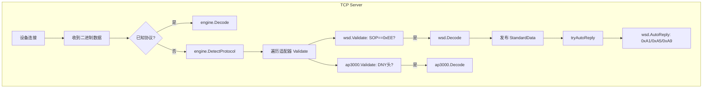

## 产品概述

为 IOTsys 物联网平台新增「微小电」品牌的电单车充电桩协议适配器（WSD_v1），实现完整的设备接入能力。该充电桩为 12 路端口机，通过 TCP 长连接与平台通信，采用自定义二进制帧协议（SOP=0xEE，XOR 校验，小端字节序）。适配器需要与现有的 AP3000 协议在同一 TCP 端口上自动区分（通过不同的帧头标识），并将设备上报数据映射到平台统一的标准数据模型。

## 核心功能

- **设备登录注册**：解析 0xA0 登录帧（SN、硬件版本、设备ID、固件版本、模块号、SIM卡号、信号值），自动回复 0xA1 带对时时间
- **心跳维护**：解析 0xA4 心跳帧（含端口实时状态、故障标志、电压、温度、所有端口充电动态），自动回复 0xA5 心跳应答
- **设备对时**：解析 0xA8 对时请求，自动回复 0xA9 带当前时间
- **充电状态监控**：解析 0xB4 本地充电上报、0xBB 结算订单上传、0xC0 故障报警、0xC2 充电分档上报
- **远程控制指令下发**：通过 Encode() 构建远程启动(0xB7)、远程停止(0xB9)、读取端口状态(0xB0/B2)、设置参数表(0xC3)、读取参数(0xC5)等平台下发帧
- **在线卡管理**：解析 0xB6 刷卡上报、0xD0 查询在线卡，支持平台返回 0xBD 无效卡/余额不足、0xD1 卡信息
- **前端展示**：在设备管理、协议管理、系统监控页面中新增微小电协议选项

## 技术栈

- **后端语言**: Go 1.21+
- **Web 框架**: Gin
- **数据库**: MySQL + Redis + MongoDB (已有)
- **消息队列**: Kafka (已有 noop 适配)
- **前端**: Vue 3 + TypeScript + Element Plus (已有)
- **协议格式**: 二进制帧，小端序，XOR 校验

## 实现方案

### 核心策略

仿照 `ap3000/ap3000.go` 的架构模式，创建新的 `wsd/wsd.go` 适配器文件，实现 `engine.ProtocolAdapter` 接口的所有 6 个方法。通过在 `Validate()` 中检查帧首字节 `0xEE` 与现有 AP3000（帧头 `0x44 0x4E 0x59`）实现协议自动区分。

### 关键设计决策

| 决策点 | 选择 | 理由 |
| --- | --- | --- |
| 协议名 | WSD_v1 | 微小电首版协议，与 AP3000_v2/TF100_v1 命名风格一致 |
| 设备类型 | ebike_charger | 与 AP3000 同为电单车充电桩 |
| SOP 检测 | 检查字节 0xEE | AP3000 首字节为 0x44 ('D')，不会冲突 |
| LEN 校验顺序 | Validate 中先检查 LEN + SOP | 避免误判短数据包 |
| AutoReply | 实现 0xA1/0xA5/0xA9 | 仅对需要平台自动回复的查询类指令做回复，控制指令不自动回复 |
| SESSION_ID 生成 | crypto/rand 6字节随机数 | 平台下发指令时生成，用于匹配设备响应 |
| 参数表编解码 | 内置参数表结构体 + 序列化 | 28 项参数按固定偏移编解码 |


### 帧结构常量定义

```
SOP = 1 byte (0xEE)
LEN = 1 byte
CMD = 1 byte
SESSION_ID_LEN = 6 bytes
SUM = 1 byte
FrameOverhead = SOP(1) + LEN(1) = 2 (固定开销)
MinFrameLen = SOP(1) + LEN(1) + CMD(1) + SESSION_ID(6) + SUM(1) = 10 bytes
```

## 架构设计

### 系统架构

适配器作为独立 Go 包，通过 `init()` 自注册到全局协议注册中心，无需修改引擎核心代码。



### 数据流

```
设备上报 0xA0 登录帧
  → Validate() 检查 SOP=0xEE 通过
  → Decode() 解析各字段填充 StandardData
  → publishDeviceData() 发布到 Kafka + SSE
  → tryAutoReply() → AutoReply() 构建 0xA1 含对时时间
  → session.Conn.Write(reply) 发送回复

平台下发 启动充电指令
  → StandardCommand{CmdType: "start_charge", Port: 3, ...}
  → Encode() 构建 0xB7 帧(生成随机 SESSION_ID)
  → TCP 连接发送 → 设备回复 0xB8 响应帧
  → DecodeResponse() 解析响应
```

## 目录结构

```
e:\IOTsys\
├── server/
│   ├── internal/
│   │   ├── protocol/
│   │   │   └── adapters/
│   │   │       └── wsd/
│   │   │           └── wsd.go          # [NEW] 微小电协议适配器主文件
│   │   └── system/
│   │       └── handler.go             # [MODIFY] 适配器列表新增 WSD 条目
│   └── cmd/
│       └── main.go                    # [MODIFY] import _ "adapters/wsd"
├── web/
│   └── admin/
│       └── src/
│           ├── views/
│           │   ├── devices/
│           │   │   ├── index.vue      # [MODIFY] 协议下拉新增 WSD_v1
│           │   │   └── detail.vue     # [MODIFY] 协议显示兼容 WSD_v1
│           │   ├── protocols/
│           │   │   └── index.vue      # [MODIFY] 新增 WSD_v1 协议卡片
│           │   └── system/
│           │       └── index.vue      # [MODIFY] 适配器列表新增 WSD 条目
```

## 关键代码结构

### wsd.go 核心接口（伪码）

```
// 协议常量
const (
    ProtocolName    = "WSD_v1"
    ProtocolVersion = "1.0"
    DeviceType      = "ebike_charger"

    SOP       = 0xEE
    MinFrameLen = 10  // SOP(1)+LEN(1)+CMD(1)+SESSION_ID(6)+SUM(1)
    
    // 设备上报命令
    CmdLogin        = 0xA0
    CmdHeartbeat    = 0xA4
    CmdTimeRequest  = 0xA8
    CmdLocalCharge  = 0xB4
    CmdSwipeCard    = 0xB6
    CmdSettlement   = 0xBB
    CmdFaultAlarm   = 0xC0
    CmdGearReport   = 0xC2
    CmdConfigUpload  = 0xC6
    CmdPlatformParam = 0xC7
    CmdQueryCard    = 0xD0
    CmdRemoteCtrlAck = 0xA3
    CmdHBAck        = 0xA7
    CmdRemoteStartAck = 0xB8
    CmdRemoteStopAck  = 0xBA
    CmdParamSetAck    = 0xC4
    // ...

    // 平台下发命令
    CmdLoginAck     = 0xA1
    CmdRemoteCtrl   = 0xA2
    CmdHeartbeatAck = 0xA5
    CmdSetHBInterval = 0xA6
    CmdTimeSyncAck  = 0xA9
    CmdQueryAllPorts = 0xB0
    CmdQueryOnePort  = 0xB2
    CmdChargeAck    = 0xB5
    CmdRemoteStart  = 0xB7
    CmdRemoteStop   = 0xB9
    CmdSetParam     = 0xC3
    CmdReadParam    = 0xC5
    CmdFaultAck     = 0xC1
    CmdSettlementAck = 0xBC
    CmdCardReply    = 0xD1
    CmdCardInvalid  = 0xBD
)

type WSDAdapter struct{}
```

### 参数表结构体（28项配置参数）

```
type DeviceParams struct {
    Mode            byte     // 0=投币 1=按键 2=网络模式
    GearCount       byte     // 路数 0-8
    CoinTime1       uint16   // 投币1次时间(分钟)
    CardTime1       uint16   // 刷卡1次时间(分钟)
    CardDeduction   byte     // 扣费单价 0.1元
    CardRefund      byte     // 0=不退款 1=退款
    GearPower       [8]uint16 // 8档功率值 单位0.1W
    GearRatio       [8]byte   // 8档比例 单位1%
    FullAutoStop    byte     // 充满自停 0=关 1=开
    FloatPower      uint16   // 浮充功率 0.1W
    FloatTime       uint16   // 浮充时间 秒
    RemoveCheckTime uint16   // 移除检测时间 秒
    Password        uint16   // 密码
    TempAlarm       byte     // 温度保护 0xFF=关 50-100=度
}
```

## 实现要点

### 性能

- 帧解析无内存分配优化：直接切片操作，无额外 copy
- 端口数据循环解析：最多支持 12 路，O(n) 线性遍历
- XOR 校验和：单字节运算，O(1) 复杂度

### 日志

- 使用项目已有的 `zap` 日志器
- 解析失败的帧记录 hex dump 便于排查
- AutoReply 发送记录日志但不刷屏（已有限速）

### 兼容性

- 通过 `Validate()` 首字节检查 0xEE，与 AP3000 的 DNY 头(0x44)完全隔离
- 不修改现有引擎、TCP Server、模型层代码
- 前端仅新增选项，不影响现有功能

### 边界条件

- 最小帧长 10 字节校验
- LEN 字段与实际数据长度一致性校验
- XOR 校验和验证失败静默丢弃
- 短超时(15ms 连包间隔)处理

## 代理扩展

### Skill

- **全栈开发**
- 用途：参考前端-后端集成清单，确保新增 API 调用规范、类型安全、错误处理与现有前端架构一致
- 预期产出：前端 API 调用遵循项目已有 fetch 封装模式，组件加载/错误状态处理完整

### SubAgent

- **code-explorer**
- 用途：在创建计划前深入探索 ap3000.go 完整实现（30KB），提取可复用的编解码模式、buildFrame 细节、AutoReply 签名等
- 预期产出：精确的 API 签名、常量和结构体定义，确保新适配器与引擎接口对齐